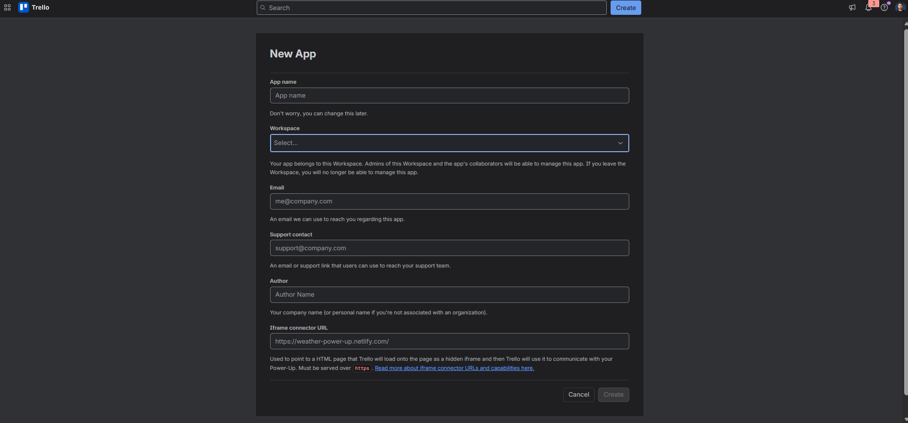
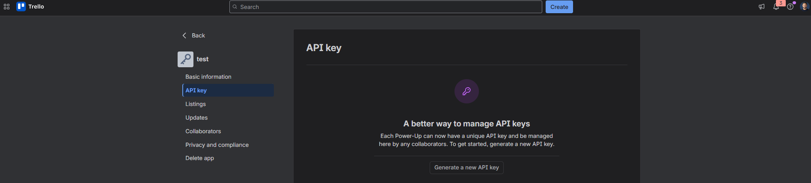
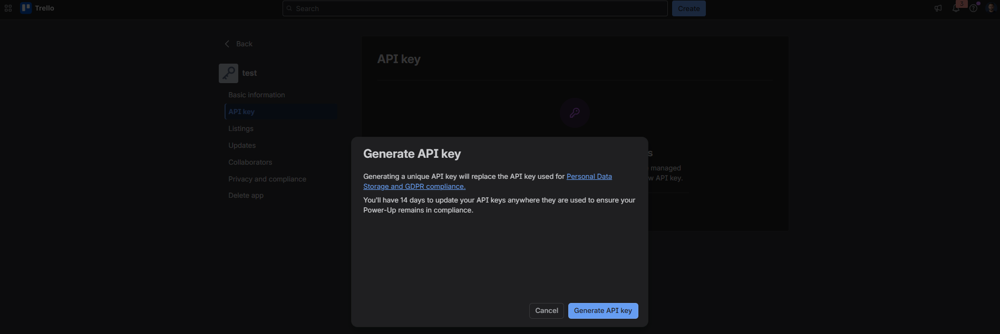
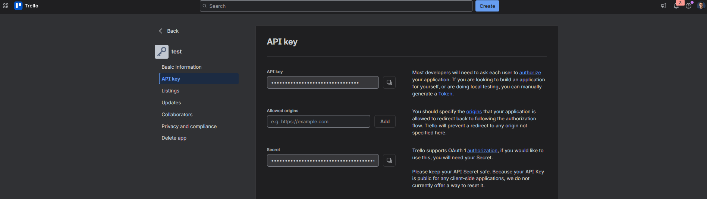

# trello-skill

**Give Claude Code direct Trello access — no MCP server, no background process.**

Download attachment bytes, upload local files, post comments, and drive cards through their whole lifecycle straight from a Claude Code session. Install in one command via the Claude plugin marketplace, or drop the files into `~/.claude/skills/` manually.

---

## Why this exists

Most Trello integrations can read cards and write comments. Then you ask for the one thing you actually needed — *"grab the PDF attached to that card"* or *"upload this screenshot to the card"* — and they can't. Attachment **bytes** need a specific auth header that query params don't satisfy, so most tools quietly skip the feature.

This skill closes that gap. It's a thin `curl` layer over Trello's raw REST API, tuned so an AI agent can do the file-moving work end to end:

- **Download attachment bytes** — the part most Trello MCP servers miss.
- **Upload local files** to a card in one call.
- **Read** boards, lists, cards, and attachment metadata — responses trimmed with `fields=` so they stay token-lean.
- **Comment and edit comments** with a file-based text path that survives non-ASCII characters (em-dashes, accents, emoji) instead of corrupting them.
- **Drive the card lifecycle** — create, add checklists, tick items, move between lists.
- **Ships with the hard-won gotchas baked in** — the auth-header trap, a write-throttle quirk, and an encoding pitfall are all documented in `SKILL.md` so you don't rediscover them the hard way.

---

## Skill or MCP server?

This is a **Claude Code skill**, not an MCP server.

- A **skill** is a folder Claude Code auto-loads from `~/.claude/skills/`. Nothing runs in the background; there's nothing to register. You drop the files in and mention Trello.
- An **MCP server** is a long-running process you wire into settings and keep alive.

Skills work across the Claude ecosystem — **Claude Code, Claude.ai, and the Claude Agent SDK** all read the same `SKILL.md` format. The underlying `trello.sh` is plain shell, so any other agent (or a human) can `source` it and call the functions directly.

---

## Prerequisites

- [Claude Code](https://claude.com/claude-code)
- `bash`, `curl`, and `python` — all present by default on macOS and Linux
- A Trello account

---

## Install

### Option A — Plugin marketplace (recommended)

Add this repo as a marketplace and install in two commands from inside Claude Code:

```
/plugin marketplace add towfikul-islam/trello-skill
/plugin install trello@towfik
```

Then run `/reload-plugins`. Skills are namespaced, so invoke them as `/trello:...` or just mention Trello naturally and Claude picks up the skill.

> **Community marketplace:** Submission to `anthropics/claude-plugins-community` is pending review. Once approved, you'll also be able to install with `/plugin install trello@claude-community`.

### Option B — Manual (classic)

```bash
git clone https://github.com/towfikul-islam/trello-skill.git
cd trello-skill
mkdir -p ~/.claude/skills
cp -r skills/trello ~/.claude/skills/trello
```

You should now have `~/.claude/skills/trello/SKILL.md` and `~/.claude/skills/trello/trello.sh`.

### 2. Get your Trello API key + token (both options)

Open **https://trello.com/power-ups/admin/new** and fill in the **New App** form. Only *App name* and *Workspace* matter for personal use; **Email**, **Support contact**, **Author**, and the optional **Iframe connector URL** can be anything or left blank. Click **Create**.



Creating the app drops you on the **API key** page. Click **Generate a new API key**.



Confirm in the dialog by clicking **Generate API key**.



Copy your **API key**. Then, for a **token**, click the **Token** link in the sentence *"you can manually generate a Token"* (top-right of this page), authorize the app when Trello prompts you, and copy the token it shows.



> You only need the **API key** and the **token**. Keep the **Secret** to yourself — this skill doesn't use it.

### 3. Create your private credentials file

```bash
cp .trello.env.example ~/.claude/.trello.env
# then edit ~/.claude/.trello.env and paste your TRELLO_KEY and TRELLO_TOKEN
```

### 4. Add your member ID

With the key and token set, fetch your member ID and paste it into the same file:

```bash
source ~/.claude/skills/trello/trello.sh   # manual install
# OR (plugin install): trello.sh is on PATH — just run:
# source trello.sh
tr_get "/1/members/me?fields=id,username"
```

Copy the `id` from the output into `TRELLO_MEMBER_ID` in `~/.claude/.trello.env`. Only `tr_mine` / `tr_mine_board` use it — it's a one-time convenience step.

### 5. Verify

```bash
source ~/.claude/skills/trello/trello.sh   # manual install; plugin install: source trello.sh
tr_me        # -> your username + full name
tr_boards    # -> your boards and their IDs
```

If those return your account, you're set. In a Claude Code session, just mention Trello (e.g. *"list my Trello boards"*) and Claude uses the skill.

---

## What you can call

Each shell is fresh, so the skill re-`source`s `trello.sh` every call, then uses functions like:

| Function | What it does |
|---|---|
| `tr_me` | Verify creds → your username |
| `tr_boards` | List boards + IDs |
| `tr_lists BOARD_ID` | Lists on a board |
| `tr_cards LIST_ID` | Cards in a list |
| `tr_card SHORTLINK` | One card by shortlink/ID |
| `tr_atts CARD_ID` | Attachments on a card |
| `tr_dl CARD_ID ATT_ID FILENAME OUTPATH` | **Download attachment bytes** |
| `tr_comment CARD_ID "text"\|FILE` | Post a comment |
| `tr_comment_update ACTION_ID "text"\|FILE` | Edit an existing comment |
| `tr_upload CARD_ID FILEPATH` | **Attach a local file** |
| `tr_card_update CARD_ID name=FILE [desc=FILE]` | Update card title/description |
| `tr_card_create LIST_ID NAME [DESC_FILE]` | Create a card |
| `tr_checklist_add CARD_ID NAME` | Add a checklist |
| `tr_checkitem_add CHECKLIST_ID NAME\|FILE` | Add a checklist item |
| `tr_card_checklists CARD_ID` | List checklists on a card (get CHECKLIST_IDs) |
| `tr_checkitems CHECKLIST_ID` | List checklist items with state |
| `tr_checkitem_set CARD_ID ITEM_ID complete\|incomplete` | Tick / untick an item |
| `tr_card_move CARD_ID LIST_ID` | Move card between lists |
| `tr_mine LIST_ID` / `tr_mine_board BOARD_ID` | Cards assigned to you |
| `tr_get "/1/..."` | Raw passthrough for any endpoint |

The full reference, comment-writing style, safety notes, and hard-won gotchas live in [`trello/SKILL.md`](trello/SKILL.md).

---

## Security

- Your token grants **full access to your Trello account**. It lives only in `~/.claude/.trello.env`, which `.gitignore` keeps out of git. Never paste it into a commit, a comment, or a chat.
- **This repo contains no credentials** — only the skill code and this guide.
- Destructive operations (delete/archive) are intentionally *not* wrapped. Claude confirms with you before running them by hand.

---

## Notes

- **Each user brings their own creds.** Nothing about anyone else's account transfers — you generate your own key, token, and member ID above.
- **Board and list IDs are discovered at runtime** (`tr_boards`, `tr_lists`). Claude records the ones you use often in its own memory over time.
- `SKILL.md` documents a Windows text-encoding quirk (non-ASCII args getting mangled). macOS and Linux are UTF-8 native, so it won't affect you — the skill's file-based text path works everywhere regardless.

---

If this saves you time, a ⭐ on the repo helps others find it.